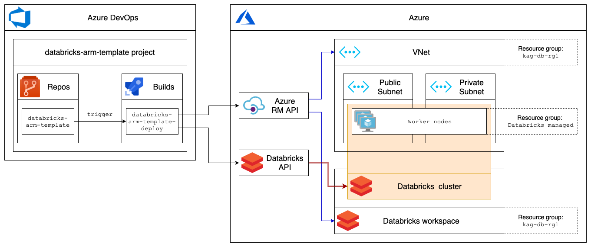

| Build status  | License |
| ------------- | ------------- |
|  |   |

# Task
Provision Azure Databricks workspace and cluster ([only interactive cluster can be created in advance](https://docs.databricks.com/clusters/index.html))  
Cluster nodes must be located in VNet  

# Solution

# Challenges
## Databricks cluster can't be created with ARM template
Instead of it [Databricks API](https://docs.microsoft.com/en-us/azure/databricks/dev-tools/api/latest/clusters#--create) must be used  
To use API you have to have the token, previously it was possible only via manual action in Databricks UI  
Now Azure AD can be used to create Databricks token  
For security purposes I generate token in pipeline with 20 min TTL (it's required to initiate cluster creation and check result)  

## Databricks API is not available right after Workspace is created
It becomes available few seconds after Workspace deployment is complete, so pipeline has `sleep 60` task  

## Databricks API asynchronous way
`2.0/clusters/create` API is asynchronous, that means that you have to check if cluster was successfully created with `2.0/clusters/get` in a while  
I tested pipeline with rather small clusters so pipeline has `sleep 600` task, if you create big clusters deploy time might be larger, so increase that value  

# Required input (Azure DevOps variable groups)
## azure-connection
| Name | Value | Type | Comment |
|--|--|--|--|
| azureSubscription | `Pay-As-You-Go (b31bc8ae-8938-41f1-b0b2-f707d811d596)` | Regular | Subscription Name under which the build will be performed |

## azure-tags
| Name | Value | Type | Comment |
|--|--|--|--|
| environment | `sbx` | Regular | Azure Tag used to track environments |
| project | `databricks-arm-template` | Regular | Azure Tag used to track projects |

## azure-databricks
| Name | Value | Type | Comment |
|--|--|--|--|
| region | `eastus` | Regular | Location for all resources |
| rgName | `kag-db-rg1` | Regular | Name of the Resource group to be used for Databricks and VNet |
| workspaceName | `kag-db-ws1` | Regular | The name of the Azure Databricks workspace to create |
| clusterName | `kag-cl1` | Regular | Cluster name requested by the user. This doesn't have to be unique |
| clusterVersion | `6.4.x-scala2.11` | Regular | The runtime version of the cluster. You can retrieve a list of available runtime versions by using the [Runtime Versions API call](https://docs.microsoft.com/en-us/azure/databricks/dev-tools/api/latest/clusters#clusterclusterservicelistsparkversions) |
| clusterDriverSize | `Standard_D3_v2` | Regular | The node type of the Spark driver |
| clusterWorkersSize | `Standard_D3_v2` | Regular |The node type of the Spark worker |
| clusterWorkersQuantity | `1` | Regular | Number of worker nodes that this cluster should have (autoscaling is disabled) |
